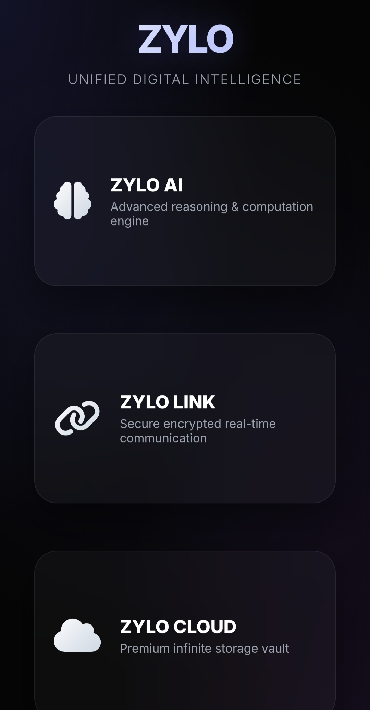
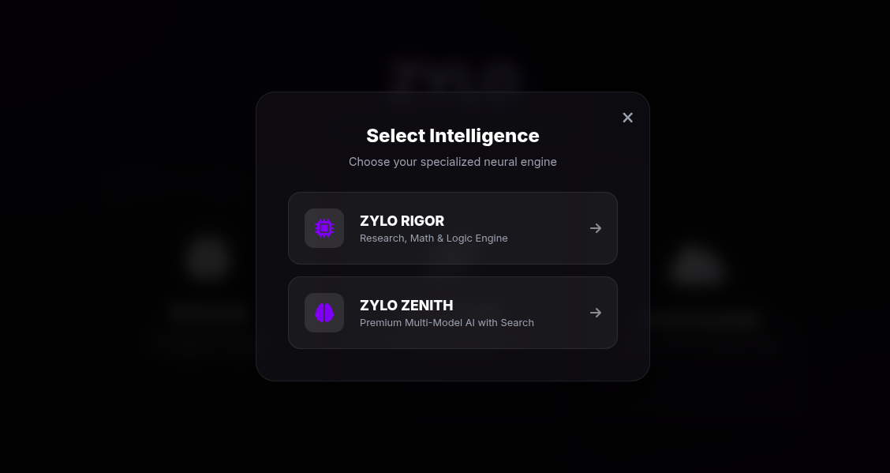
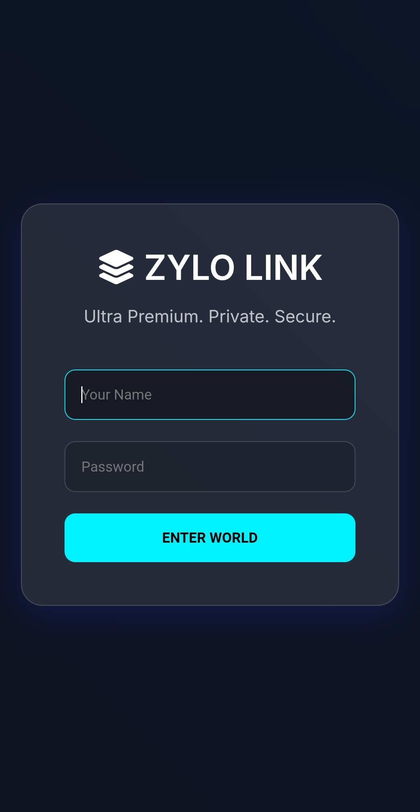
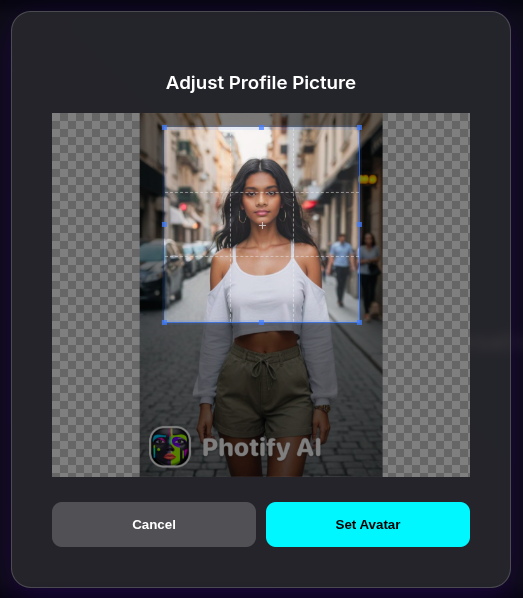
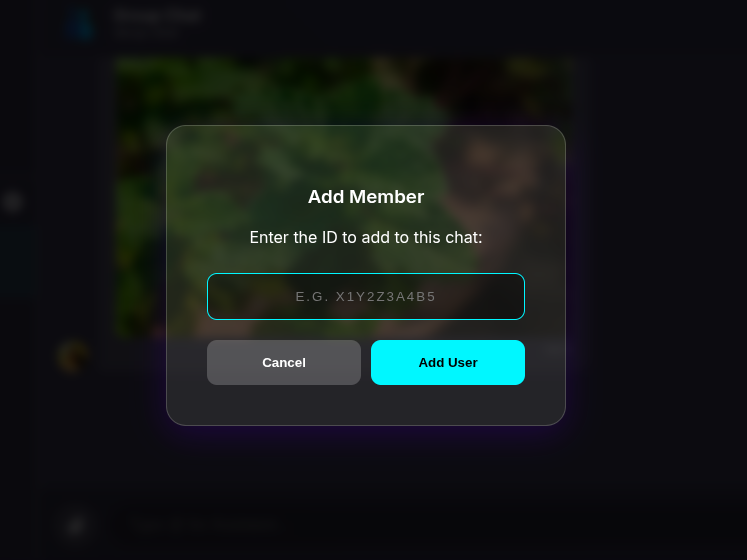
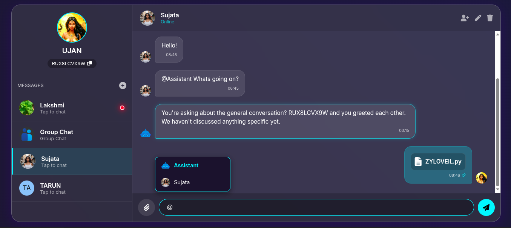
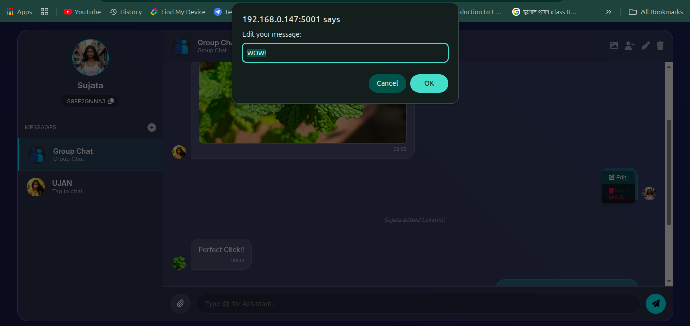
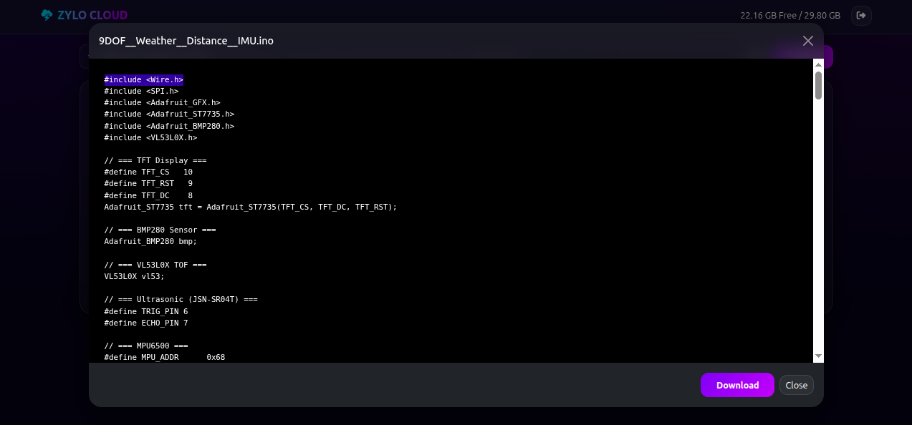
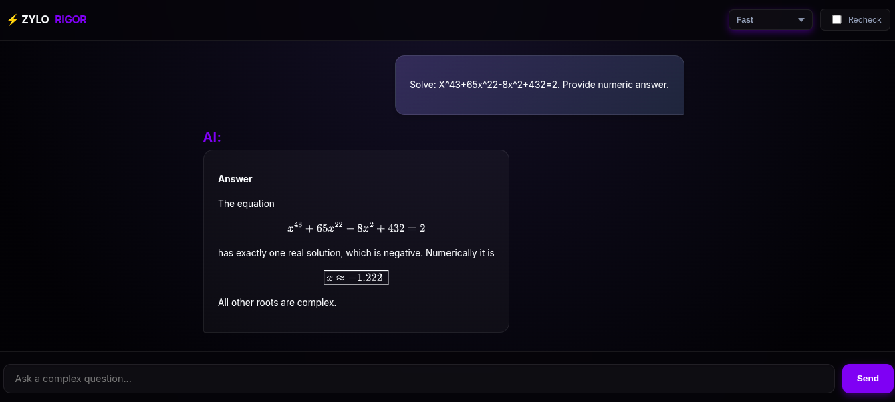
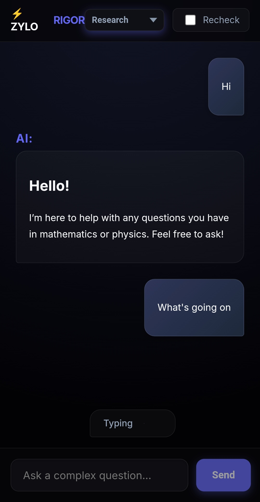

# ZYLO UNIFIED


> **A Unified Research‑Grade Platform for Secure Intelligence, Communication, Storage, and Verification**

ZYLO UNIFIED is a comprehensive research-oriented platform designed to consolidate secure communication, private data storage, advanced cryptography, AI-assisted intelligence, and formal mathematical and physical verification into a single, cohesive system. Rather than addressing these domains in isolation, ZYLO UNIFIED is built around a shared trust and execution model that ensures consistent security, accountability, and integrity across all components.

At its core, the platform treats cryptography, intelligence, and data governance as foundational infrastructure rather than auxiliary features. Real-time communication, cloud-like storage, steganographic security, and AI reasoning are tightly integrated, enabling controlled data flow, verifiable outputs, and adversary-aware operation within an offline-first environment.

This repository functions as the unification and orchestration layer for the ZYLO ecosystem, binding multiple advanced subsystems into a modular, extensible architecture. It is intended for research, experimentation, and system-level exploration of next-generation secure intelligence platforms, where correctness, trust, and resilience are first-class design constraints rather than afterthoughts.

<p align="center">
  
  
</p>

<p align="center">
  
</p>

---

## Core Philosophy

* **Unification over fragmentation** — one system, one trust root
* **Offline‑first** — no mandatory SaaS dependencies
* **Cryptography as infrastructure**, not an add‑on
* **Verifiable intelligence** — AI output can be audited and checked
* **Anti‑forensic awareness** — designed with adversarial analysis in mind

---

## Integrated Subsystems

ZYLO UNIFIED brings together the following research projects:

* **ZYLO ZENITH** — Unified Multi-Model Intelligence & Media Engine
* **ZYLO LINK** — Secure real‑time communication with AI integration
* **ZYLO RiG0R** — Formal mathematics and physics verification engine
* **ZYLO FEELS** — Context-aware weather intelligence with live UI, LLM summaries, and voice playback
* **ZYLO CLOUD** — Private, self‑hosted cloud storage and filesystem with user-specific quotas and integrated user accounts. Now features a "Premium storage vault" description on the landing page.
* **ZYLO VEIL** — Experimental cryptographic steganography and destructive security

Each module is independently powerful; ZYLO UNIFIED makes them **operate as one system**.

---

## What Makes ZYLO UNIFIED Different

Most platforms focus on **one** of the following:

* encryption
* messaging
* cloud storage
* AI
* formal reasoning

ZYLO UNIFIED deliberately combines **all of them** under a **shared identity, shared cryptographic state, and shared execution context**.

### Key Differentiators

* **Single Trust Root** across chat, storage, AI, and steganography
* **Verifiable AI** using formal math/physics validation
* **Steganographic Security Layers** beyond conventional encryption
* **Self‑destruct and mutation mechanisms** for sensitive data
* **No mandatory external services**

---

## High‑Level Architecture

```

                      ┌─────────────────────────┐
                      │       ZYLO UNIFIED      │
                      │    System Orchestrator  │
                      └───────────┬─────────────┘
                                  │
        ┌─────────┬───────────────┼───────────────┬─────────┐
        │         │               │               │         │
┌───────▼────┐ ┌──▼────────┐ ┌────▼───────┐   ┌───▼───────┐ ┌───▼─────────┐
│ ZYLO LINK  │ │ZYLO ZENITH│ │ ZYLO CLOUD │   │ ZYLO VEIL │ │  ZYLO RiG0R │
│ Secure Chat│ │Multi-Model│ │ Private FS │   │Stego/Crypto││ Verification│
│ + AI       │ │ AI Engine │ │ Offline    │   │Destructive│ │ Math/Physics│
└────────────┘ └───────────┘ └────────────┘   └───────────┘ └─────────────┘


```

---

## Feature Deep Dive

### 1. ZYLO LINK (`chat.py`)
A real-time, persistent communication layer.
*   **Protocol**: Socket.IO based real-time messaging.
*   **AI Integration**: Built-in access to LLMs (Groq/Llama) via `@Assistant` mentions.
*   **Security**: Local SQLite storage, user authentication.
*   **UX**: "Glassmorphism" design, typing indicators, read receipts, file sharing, avatar cropping.

<p align="center">
  
  
  
</p>

<p align="center">
  
</p>

<p align="center">
  
</p>


### 2. ZYLO CLOUD (`Cloud_Storage.py`)
A self-hosted, private file vault with user-specific storage quotas.
*   **Storage**: Direct interface to local encrypted partitions or external media (SD cards/USBs). Each user gets a private vault with a default 1GB quota.
*   **Management**: Full file system operations (Upload, Download, Preview, Delete, Mkdir). Supports progress bars for uploads and clear error messages for quota exceeded.
*   **Access Control**: Secure "Vault Unlock" mechanism requiring ZYLO Username and an Access Key, linking directly to user accounts.
*   **Performance**: Streaming uploads/downloads, efficient directory listing. Integrated UI warnings for full storage.

<p align="center">
  
  
</p>

<p align="center">
  
</p>

<p align="center">
  
</p>


### 3. ZYLO VEIL (`ZYLOVEIL.py`)
Advanced steganography and data hiding.
*   **Shamir Secret Sharing**: Splits data across multiple carrier images; $k$ out of $n$ carriers are needed to recover the data.
*   **Stateless Mode**: Deterministic embedding that requires no side-channel storage.
*   **Anti-Forensics**: adaptive noise injection to mimic camera sensor noise and defeat statistical steganalysis.
*   **Destructive Security**:
    *   **Time Locking**: Data accessible only within specific time windows.
    *   **Self-Destruct**: Carrier images degrade or destroy data upon excessive failed extraction attempts.
    *   **Bit-Plane Migration**: Encoding shifts over time, rendering old copies useless.

<p align="center">
  
  
</p>

<p align="center">
  
</p>

<p align="center">
  
</p>


### 4. ZYLO RiG0R (`ZYlO_RiG0R.py`)
A formal verification engine for AI outputs.
*   **Iterative Tool Workflow**: Uses a strict JSON `ipython` tool protocol to generate, execute, and refine small computation steps.
*   **Persistent IPython Runtime**: Keeps per-session variables and execution history for multi-step math/physics work.
*   **Dual Reasoning Engines**: Standard path on Cerebras (`gpt-oss-120b`) with an Expert path on NVIDIA (`z-ai/glm5`) and streamed thinking traces.
*   **Independent Recheck**: Optional GLM-based proof recheck returns verdicts (`correct` / `incorrect` / `uncertain`) plus calibrated confidence.
*   **Safety & Output Normalization**: Sandboxed execution, resource limits, tool-output fallback rendering, and MathJax-safe response cleanup.

#### RiG0R Step-by-Step Precision Pipeline
1. The server receives a question and selects the reasoning path (`low`, `medium`, `high`, or `expert`).
2. For computational prompts, the model is guided to emit a strict JSON tool call with `{"tool":"ipython","code":"...","mode":"...","continue":...}`.
3. The code executes in a persistent per-session IPython executor with preloaded math/science libraries (SymPy, NumPy, Matplotlib).
4. RiG0R captures `stdout`, `stderr`, generated plots, and current variable snapshots, then injects them back into context.
5. The model iterates in short steps until it signals `continue: false`, ensuring traceable intermediate verification.
6. A final synthesis pass produces the answer, with math-format normalization and tool-leak cleanup for precise, readable output.
7. If enabled, independent proof recheck runs through GLM-4.7 and appends verdict plus confidence calibration.
8. In `expert` mode, solving is streamed through NVIDIA GLM5 (`z-ai/glm5`) with advanced reasoning traces before final exposition.

<p align="center">
  
</p>

<p align="center">
  
  
</p>

### 5. ZYLO ZENITH (`AI~Zenith.py`)
A premium, multi-model unified intelligence interface.
*   **Expanded Model Stack**: NVIDIA-hosted models (GPT-OSS, Mistral, Qwen, MiniMax, GLM, Kimi, DeepSeek, Llama/Nemotron) plus Gemini.
*   **Provider Fallback Chain**: Primary streaming on NVIDIA, targeted GLM fallback to Cerebras, then OpenRouter as final backup.
*   **Search & Deep Research Modes**: Real-time search via Tavily/ZenRows and deeper retrieval via ScraperAPI, including direct URL scraping.
*   **Multimodal Chat + Media Generation**: Image/file-aware chat input and one-click image/video generation (CogView-3-Flash, CogVideoX-Flash).
*   **Unified Voice Output**: `/zenith/generate_audio` supports NVIDIA Magpie TTS with automatic gTTS fallback.

### 6. ZYLO FEELS (`weather.py`)
An intelligent weather briefing module integrated into the main dashboard (`/feels`).
*   **Structured Weather Intelligence**: Normalized location, top metrics, wind, and air-quality blocks from WeatherAPI.
*   **AQI-Aware Summaries**: Computes PM2.5-based US AQI values and enriches interpretation with LLM-generated concierge-style summaries.
*   **Smart Summary Caching**: Reuses speech summaries when core weather metrics are unchanged to reduce redundant model calls.
*   **Cross-Module TTS Compatibility**: Supports both `/api/speak` and `/zenith/generate_audio`, with NVIDIA Magpie first and gTTS fallback.
*   **Interactive UI**: Live location switching, metric cards, and one-tap spoken weather playback.

#### Weather Summary Flow
1. `fetch_weather()` retrieves live WeatherAPI data with AQI enabled, then normalizes it into `Location`, `TopMetrics`, `Wind`, and `Other`.
2. `format_payload()` computes additional context such as PM2.5-derived US AQI value and mapped AQI status labels.
3. `generate_llm_summary()` produces a concise concierge-style summary using NVIDIA-hosted Mistral.
4. A metric-aware cache (`WEATHER_STATE_CACHE`) reuses prior summaries when temperature/condition/AQI/city are unchanged.
5. `build_weather_open_summary()` prepares the compact UI summary; `build_weather_summary_text()` prepares detailed speech fallback text.

#### Other `weather.py` Features
1. Dual TTS synthesis path: NVIDIA Magpie via `talk.py`, with automatic `gTTS` fallback on failure.
2. Shared audio endpoint compatibility for both standalone weather and Zenith routes.
3. Voice profile mapping for multiple Magpie styles and region-aware gTTS fallbacks.
4. Live location editing from the FEELS UI with immediate weather refresh and speech regeneration.

---

## Intended Use Cases

* Research into **secure, self‑contained AI systems**
* Private communication and data storage environments
* Cryptography and steganography experimentation
* AI output verification and trust calibration
* Educational exploration of advanced system design

---

## Project Status

**Experimental / Research‑Grade**

This project is:

* not production‑hardened
* not audited for real‑world adversaries
* intended for research, learning, and controlled environments

Security claims are **architectural**, not guarantees.

---

## Installation & Setup

### Prerequisites
*   Python 3.10+
*   System libraries for `Pillow` and `Cryptography` (often requires `build-essential`, `libjpeg-dev`, `zlib1g-dev`).

### 1. Clone the Repository
```bash
git clone https://github.com/UjanGuin/ZYLO-UNIFIED
cd ZYLO-UNIFIED
```

### 2. Install Dependencies
Run:
```bash
pip install -r requirements.txt
```

### 3. Configuration
The system relies on environment variables for API keys and configuration. Create a `.env` file or export them or hard code them replacing `paste_your_api_key_here`:

ZYLO_RIGOR:


```python
# -------------------------
# Configuration (env-first)
# -------------------------
CEREBRAS_KEYS = [
    os.getenv("CEREBRAS_API_KEY", "paste_your_api_key_here"),
    "paste_your_api_key_here"
]
MODEL_NAME = os.getenv("CEREBRAS_MODEL", "gpt-oss-120b")
# NVIDIA Expert Mode Config
NVIDIA_API_KEY = "paste_your_api_key_here"
EXPERT_MODEL = "z-ai/glm5"

GLM_API_KEY = os.getenv("ZHIPU_API_KEY", "paste_your_api_key_here")
GLM_MODEL = "glm-4.7"
PORT = int(os.getenv("PORT", "5005"))
DATA_DIR = os.getenv("OSS_SERVER_DATA", "./oss_server_data")
SESSION_DIR = os.path.join(DATA_DIR, "sessions")
LOGFILE = os.path.join(DATA_DIR, "server.log")

# Phase-aware generation controls
TEMP_PLANNING = 0.65
TEMP_EXECUTION = 0.0
TEMP_EXPOSITION = 0.03

CONFIDENCE_BY_VERDICT = {
    "correct": 0.97,
    "uncertain": 0.65,
    "incorrect": 0.25
}
```

Weather:


```python
# --- CONFIGURATION ---
API_KEY = "paste_your_api_key_here"
BASE_URL = "http://api.weatherapi.com/v1/current.json"
QUERY = "Bolpur"
REFRESH_SECONDS = 30
NVIDIA_API_KEY = os.getenv("NVIDIA_API_KEY", "paste_your_api_key_here")
NVIDIA_BASE_URL = "https://integrate.api.nvidia.com/v1"
TTS_API_KEY = os.getenv("NVIDIA_TTS_API_KEY", "paste_your_api_key_here")
TTS_FUNCTION_ID = os.getenv("NVIDIA_TTS_FUNCTION_ID", "877104f7-e885-42b9-8de8-f6e4c6303969")
TTS_SERVER = os.getenv("NVIDIA_TTS_SERVER", "grpc.nvcf.nvidia.com:443")
TTS_TALK_SCRIPT = os.getenv("TTS_TALK_SCRIPT", "/home/ujan/python-clients/scripts/tts/talk.py")
ENERGETIC_VOICE_ID = "Magpie-Multilingual.EN-US.Aria.Happy"
```

AI~ZENITH:
```python
# ====================== CONFIGURATION ======================
API_KEY = os.getenv("NVIDIA_API_KEY", "paste_your_api_key_here")
BASE_URL = os.getenv("NVIDIA_BASE_URL", "https://integrate.api.nvidia.com/v1")
GEMINI_API_KEY = os.getenv("GEMINI_API_KEY", "paste_your_api_key_here")
ZHIPU_API_KEY = os.getenv("ZHIPU_API_KEY", "paste_your_api_key_here")

# NEW KEYS
OPENROUTER_API_KEY = "paste_your_api_key_here"
TAVILY_API_KEY = os.getenv("TAVILY_API_KEY", "paste_your_api_key_here")
ZENROWS_API_KEY = os.getenv("ZENROWS_API_KEY", "paste_your_api_key_here")
CEREBRAS_API_KEY = os.getenv("CEREBRAS_API_KEY", "paste_your_api_key_here")
SCRAPERAPI_KEY = "paste_your_api_key_here"

# NVIDIA TTS (from voice.py)
TTS_API_KEY = os.getenv("NVIDIA_TTS_API_KEY", "paste_your_api_key_here")
TTS_FUNCTION_ID = os.getenv("NVIDIA_TTS_FUNCTION_ID", "877104f7-e885-42b9-8de8-f6e4c6303969")
TTS_SERVER = os.getenv("NVIDIA_TTS_SERVER", "grpc.nvcf.nvidia.com:443")
# Use absolute path found via search to ensure it works regardless of CWD
TTS_TALK_SCRIPT = os.getenv("TTS_TALK_SCRIPT", "/home/ujan/python-clients/scripts/tts/talk.py")
```

### 4. Run the Platform
The main entry point is `app.py`, which utilizes `socketio` to run the server.

```bash
python app.py
```

By default, the server runs on **port 5000**:
👉 **Access the Dashboard:** [http://localhost:5000](http://localhost:5000)

---

## Usage

Once running, navigate to the landing page. You will see four main cards and a hidden access point:

1.  **ZYLO AI**: Opens the modal to access **RiG0R** (Research Engine) or **ZENITH** (Unified AI).
2.  **ZYLO LINK**: Opens the secure chat application.
3.  **ZYLO CLOUD**: Opens the file storage vault. (Premium storage vault)
4.  **ZYLO FEELS**: Opens the live weather intelligence interface with spoken summaries (`/feels`).
5.  **ZYLO VEIL**: Accessed via a **secret gesture** on the landing page (click/drag on the subtitle "Unified Digital Intelligence" more than 100px) or directly at `/veil`.

---

## 🌐 Access From Internet (ngrok)

To expose ZYLO LINK beyond your local network:

1. Login: [https://dashboard.ngrok.com/login](https://dashboard.ngrok.com/login)

2. Copy Authtoken: [https://dashboard.ngrok.com/get-started/your-authtoken](https://dashboard.ngrok.com/get-started/your-authtoken)

3. Install ngrok:

```bash
wget https://bin.equinox.io/c/bNyj1mQVY4c/ngrok-v3-stable-linux-amd64.tgz
tar -xvzf ngrok-v3-stable-linux-amd64.tgz
sudo mv ngrok /usr/local/bin
```

4. Add your authtoken:

```bash
ngrok config add-authtoken YOUR_AUTHTOKEN
```

5. Start tunneling:

```bash
ngrok http 5000
```

```python
if __name__ == '__main__':
    print("💎 ZYLO UNIFIED SERVER STARTED | PORT 5000")
    socketio.run(app, host='0.0.0.0', port=5000, debug=False)
```

> **Note:** ngrok URLs are temporary unless you use a paid plan.

---

## License

This project is released under an open‑source license. See `LICENSE` for details.

---

## Author

**Swapnanil Guin**
Independent researcher and system designer

---

## Disclaimer

ZYLO UNIFIED is a **research platform**. Do not deploy in high‑risk or regulated environments without independent security review. The implementations of cryptographic primitives and steganography are for educational and experimental purposes.
