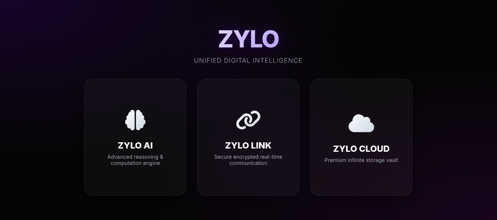
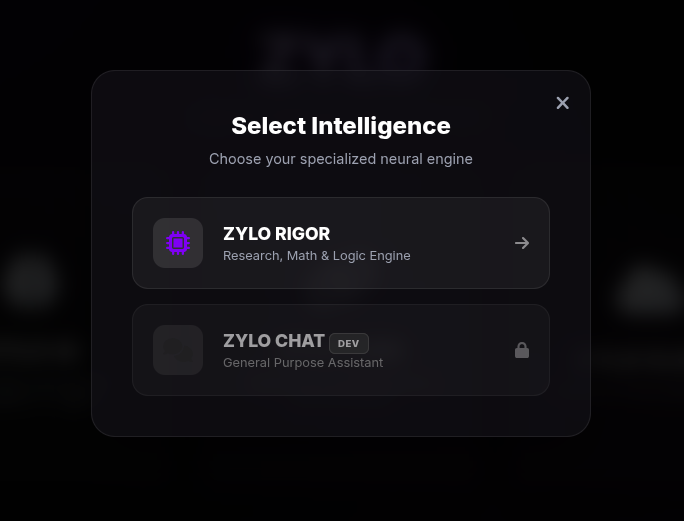
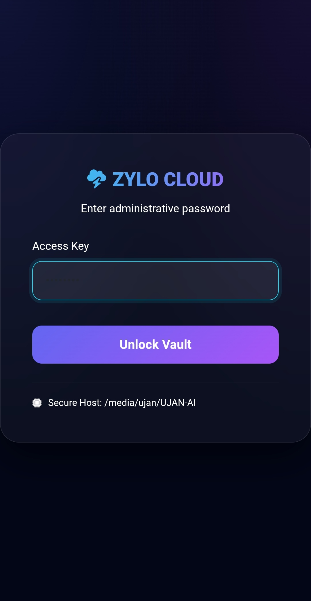
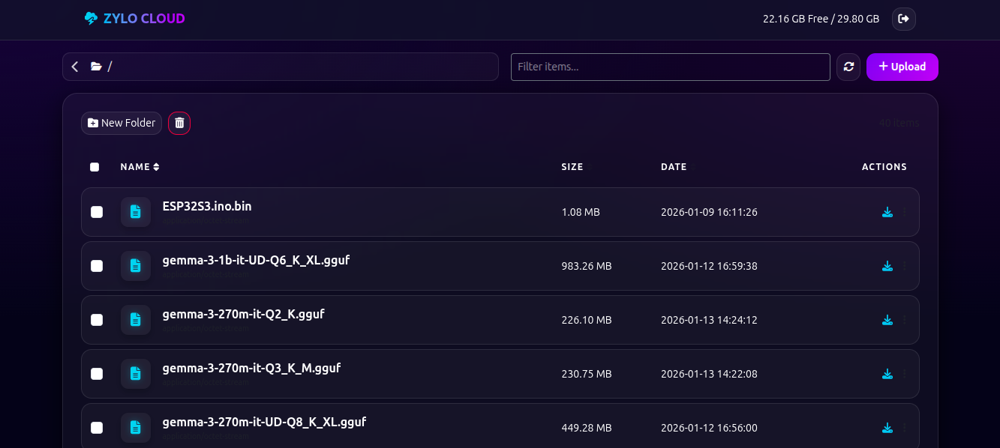
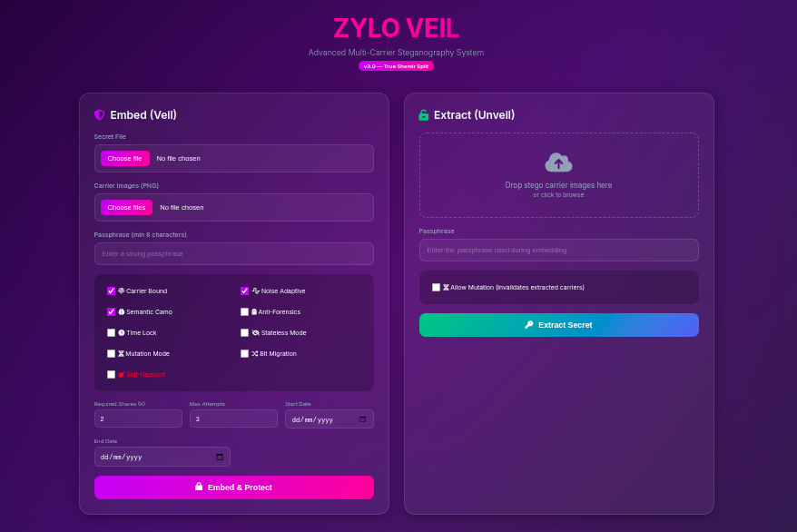
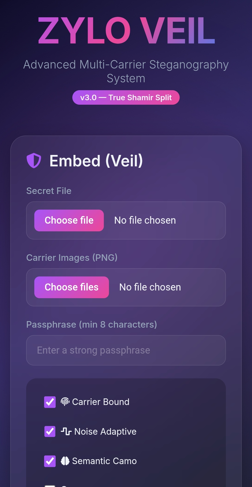
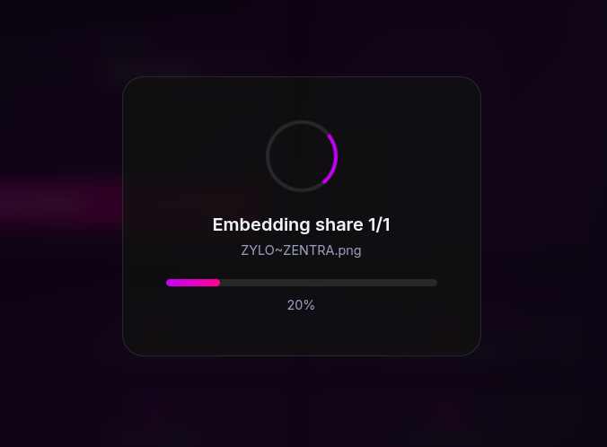
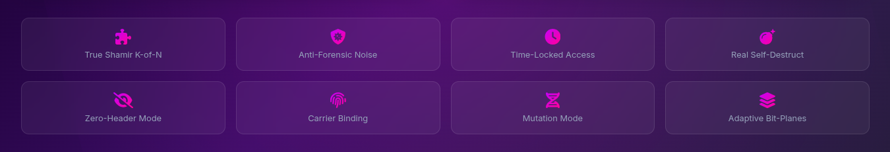

# ZYLO UNIFIED


> **A Unified Research‑Grade Platform for Secure Intelligence, Communication, Storage, and Verification**

ZYLO UNIFIED is a comprehensive research-oriented platform designed to consolidate secure communication, private data storage, advanced cryptography, AI-assisted intelligence, and formal mathematical and physical verification into a single, cohesive system. Rather than addressing these domains in isolation, ZYLO UNIFIED is built around a shared trust and execution model that ensures consistent security, accountability, and integrity across all components.

At its core, the platform treats cryptography, intelligence, and data governance as foundational infrastructure rather than auxiliary features. Real-time communication, cloud-like storage, steganographic security, and AI reasoning are tightly integrated, enabling controlled data flow, verifiable outputs, and adversary-aware operation within an offline-first environment.

This repository functions as the unification and orchestration layer for the ZYLO ecosystem, binding multiple advanced subsystems into a modular, extensible architecture. It is intended for research, experimentation, and system-level exploration of next-generation secure intelligence platforms, where correctness, trust, and resilience are first-class design constraints rather than afterthoughts.

<p align="center">
  
</p>

<p align="center">
  
</p>


<p align="center">
  
  
</p>

<p align="center">
  
</p>

<p align="center">
  
  
</p>


<p align="center">
  
</p>

<p align="center">
  
</p>

---

## Core Philosophy

* **Unification over fragmentation** — one system, one trust root
* **Offline‑first** — no mandatory SaaS dependencies
* **Cryptography as infrastructure**, not an add‑on
* **Verifiable intelligence** — AI output can be audited and checked
* **Anti‑forensic awareness** — designed with adversarial analysis in mind

---

## Integrated Subsystems

ZYLO UNIFIED brings together the following research projects:

* **ZYLO LINK** — Secure real‑time communication with AI integration
* **ZYLO RiG0R** — Formal mathematics and physics verification engine
* **ZYLO CLOUD** — Private, self‑hosted cloud storage and filesystem
* **ZYLO VEIL** — Experimental cryptographic steganography and destructive security

Each module is independently powerful; ZYLO UNIFIED makes them **operate as one system**.

---

## What Makes ZYLO UNIFIED Different

Most platforms focus on **one** of the following:

* encryption
* messaging
* cloud storage
* AI
* formal reasoning

ZYLO UNIFIED deliberately combines **all of them** under a **shared identity, shared cryptographic state, and shared execution context**.

### Key Differentiators

* **Single Trust Root** across chat, storage, AI, and steganography
* **Verifiable AI** using formal math/physics validation
* **Steganographic Security Layers** beyond conventional encryption
* **Self‑destruct and mutation mechanisms** for sensitive data
* **No mandatory external services**

---

## High‑Level Architecture

```

                      ┌─────────────────────────┐
                      │       ZYLO UNIFIED      │
                      │    System Orchestrator  │
                      └───────────┬─────────────┘
                                  │
        ┌───────────────┬─────────┼─────────┬───────────────┐
        │               │                   │               │
┌───────▼────────┐ ┌────▼───────┐   ┌───────▼───────┐ ┌─────▼───────┐
│   ZYLO LINK    │ │ ZYLO CLOUD │   │   ZYLO VEIL   │ │  ZYLO RiG0R │
│ Secure Chat    │ │ Private FS │   │ Stego/Crypto  │ │ Verification│
│ + AI Interface │ │ Offline    │   │ Destructive   │ │ Math/Physics│
└────────────────┘ └────────────┘   └───────────────┘ └─────────────┘


```

---

## Feature Deep Dive

### 1. ZYLO LINK (`chat.py`)
A real-time, persistent communication layer.
*   **Protocol**: Socket.IO based real-time messaging.
*   **AI Integration**: Built-in access to LLMs (Groq/Llama) via `@Assistant` mentions.
*   **Security**: Local SQLite storage, user authentication.
*   **UX**: "Glassmorphism" design, typing indicators, read receipts, file sharing, avatar cropping.

### 2. ZYLO CLOUD (`Cloud_Storage.py`)
A self-hosted, private file vault.
*   **Storage**: Direct interface to local encrypted partitions or external media (SD cards/USBs).
*   **Management**: Full file system operations (Upload, Download, Preview, Delete, Mkdir).
*   **Access Control**: Simple passphrase-based locking mechanism.
*   **Performance**: Streaming uploads/downloads, efficient directory listing.

### 3. ZYLO VEIL (`ZYLOVEIL.py`)
Advanced steganography and data hiding.
*   **Shamir Secret Sharing**: Splits data across multiple carrier images; $k$ out of $n$ carriers are needed to recover the data.
*   **Stateless Mode**: Deterministic embedding that requires no side-channel storage.
*   **Anti-Forensics**: adaptive noise injection to mimic camera sensor noise and defeat statistical steganalysis.
*   **Destructive Security**:
    *   **Time Locking**: Data accessible only within specific time windows.
    *   **Self-Destruct**: Carrier images degrade or destroy data upon excessive failed extraction attempts.
    *   **Bit-Plane Migration**: Encoding shifts over time, rendering old copies useless.

### 4. ZYLO RiG0R (`ZYlO_RiG0R.py`)
A formal verification engine for AI outputs.
*   **Mode A (Tool Mode)**: Forces the AI to write executable Python/SymPy code to mathematically prove its answers.
*   **Mode B (Direct Answer)**: For purely theoretical concepts.
*   **Verification**: Automatically runs generated code in a sandbox to validate results against the AI's claims.
*   **Confidence Calibration**: Assigns reliability scores to answers based on verification success.

---

## Intended Use Cases

* Research into **secure, self‑contained AI systems**
* Private communication and data storage environments
* Cryptography and steganography experimentation
* AI output verification and trust calibration
* Educational exploration of advanced system design

---

## Project Status

**Experimental / Research‑Grade**

This project is:

* not production‑hardened
* not audited for real‑world adversaries
* intended for research, learning, and controlled environments

Security claims are **architectural**, not guarantees.

---

## Installation & Setup

### Prerequisites
*   Python 3.10+
*   System libraries for `Pillow` and `Cryptography` (often requires `build-essential`, `libjpeg-dev`, `zlib1g-dev`).

### 1. Clone the Repository
```bash
git clone https://github.com/UjanGuin/ZYLO-UNIFIED
cd ZYLO-UNIFIED
```

### 2. Install Dependencies
Run:
```bash
pip install -r requirements.txt
```

### 3. Configuration
The system relies on environment variables for API keys and configuration. Create a `.env` file or export them:

```bash
# General
export ZYLO_SECRET_KEY="your_super_secret_key"

# ZYLO LINK (AI Chat)
export GROQ_API_KEY="gsk_..."  # Optional, falls back to internal key

# ZYLO RiG0R (Compute)
export CEREBRAS_API_KEY="csk-..."
export OSS_SERVER_DATA="./oss_server_data"
```

*Note: Some keys are hardcoded in the source for development convenience (`7149` for Cloud password, dev keys for AI). **Change these immediately for any real deployment.***

### 4. Run the Platform
The main entry point is `app.py`, which utilizes `socketio` to run the server.

```bash
python app.py
```

By default, the server runs on **port 5001**:
👉 **Access the Dashboard:** [http://localhost:5001](http://localhost:5001)

---

## Usage

Once running, navigate to the landing page. You will see three main cards and a hidden access point:

1.  **ZYLO AI**: Opens the modal to access **RiG0R** (Research Engine).
2.  **ZYLO LINK**: Opens the secure chat application.
3.  **ZYLO CLOUD**: Opens the file storage vault.
4.  **ZYLO VEIL**: Accessed via a **secret gesture** on the landing page (click/drag on the subtitle "Unified Digital Intelligence" more than 100px) or directly at `/veil`.

---

## 🌐 Access From Internet (ngrok)

To expose ZYLO LINK beyond your local network:

1. Login: [https://dashboard.ngrok.com/login](https://dashboard.ngrok.com/login)

2. Copy Authtoken: [https://dashboard.ngrok.com/get-started/your-authtoken](https://dashboard.ngrok.com/get-started/your-authtoken)

3. Install ngrok:

```bash
wget https://bin.equinox.io/c/bNyj1mQVY4c/ngrok-v3-stable-linux-amd64.tgz
tar -xvzf ngrok-v3-stable-linux-amd64.tgz
sudo mv ngrok /usr/local/bin
```

4. Add your authtoken:

```bash
ngrok config add-authtoken YOUR_AUTHTOKEN
```

5. Start tunneling:

```bash
ngrok http 5000
```

```python
if __name__ == "__main__":
    print("\n💎 ZYLO LINK Ultimate Running Successfully")
    print("👉 http://127.0.0.1:5000")
    socketio.run(app, host="0.0.0.0", port=5000, debug=False)
```

> **Note:** ngrok URLs are temporary unless you use a paid plan.

---

## License

This project is released under an open‑source license. See `LICENSE` for details.

---

## Author

**Swapnanil Guin**
Independent researcher and system designer

---

## Disclaimer

ZYLO UNIFIED is a **research platform**. Do not deploy in high‑risk or regulated environments without independent security review. The implementations of cryptographic primitives and steganography are for educational and experimental purposes.
